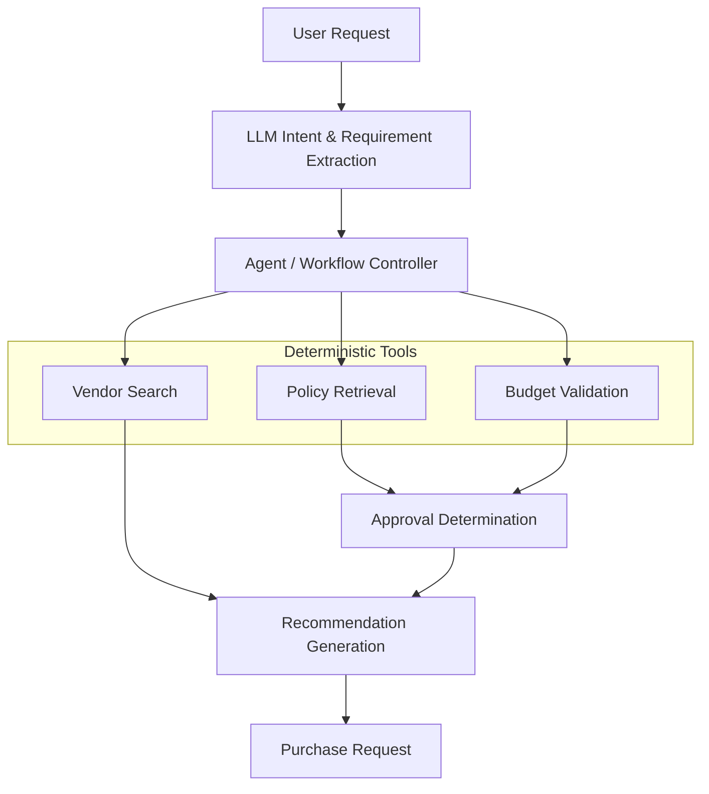
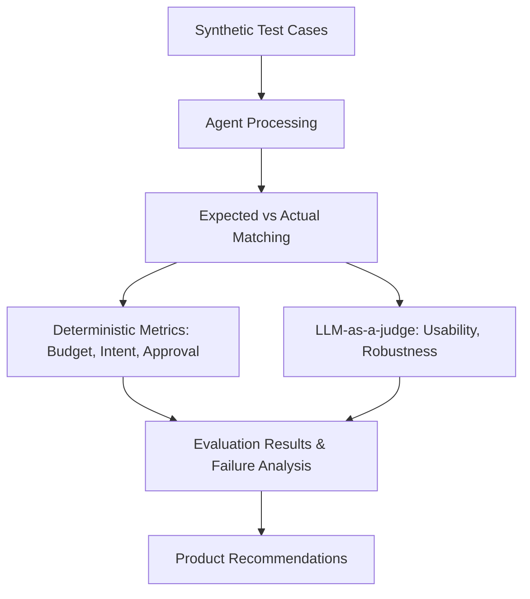

# WorkFlowAI Architecture

## Conceptual Flow

## Evaluation Architecture

## Components
1. **Frontend:** Streamlit (`app/main.py`).
2. **Agent:** `app/agent.py` orchestrates the flow using `google-genai` SDK.
3. **Tools:** `app/tools.py` provides deterministic Python functions for search and math.
4. **Evaluator:** `app/evaluator.py` runs batch testing and calculates granular metrics.
